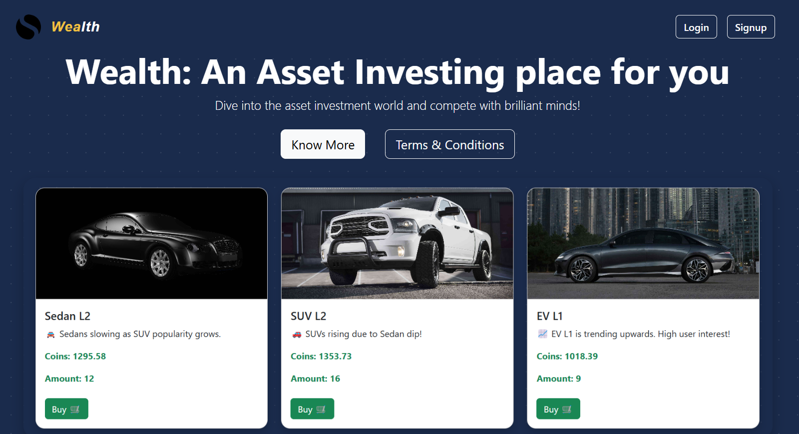
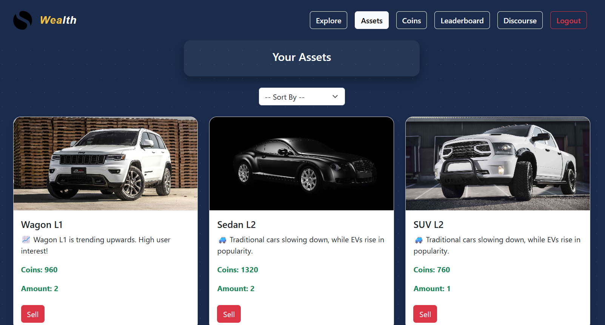
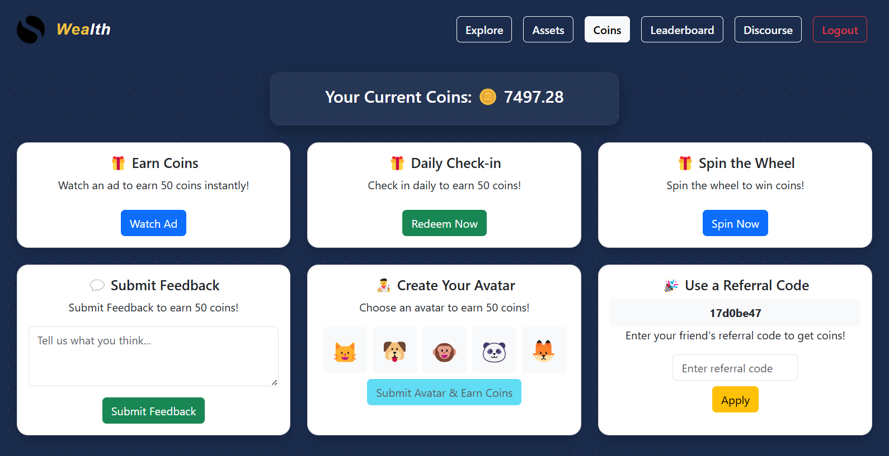
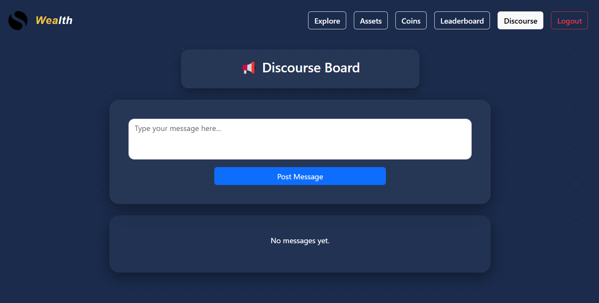

## Virtual Asset Investing App

This app is developed using MERN stack with admin dashboard and user dashboard.

### Features:

- Users can buy, sell or hold virtual assets created by admin.

- There are different ways to earn coins

- The goal is to increase coins and rank higher in leaderboard.

- There's a discourse forum in which users and admin can discuss.

- Admin can add cards, manage users, watch leaderboard and participate in discourse.

- Cronjobs are used for automatically update asset prices and coin rewards.
  

